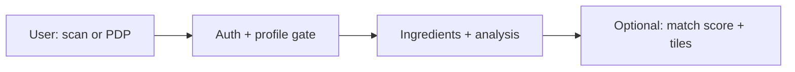

# Label Looker — Documentation (current)

This document reflects **Label Looker behavior as implemented after the June 2026 updates** discussed in product/engineering review. It supersedes older notes on guest analysis, 20/day scans, and 15% type-fit weight.

**See also (may contain stale rows — trust this file for policy):**
- `LABEL_LOOKER_API_FRONTEND.md` — endpoint paths and envelopes
- `LABEL_LOOKER_ARCHITECTURE.md` — code layout
- `LABEL_LOOKER_FRONTEND_VERIFICATION_PROMPT.md` — QA checklist (update auth/quota rows against this doc)

---

## 1. What Label Looker does

Label Looker is SkinBB’s **ingredient intelligence** feature. It answers:

1. **What is in this product, and what does the formula do?** (ingredient analysis)
2. **Is this product a good fit for me?** (Match My Profile)

It combines **user profile**, **product catalog data**, **rule-based scoring**, and **Claude AI** for readable explanations.



| Layer | Responsibility |
|--------|----------------|
| **Input** | Label photo, pasted INCI list, or catalog `productId` |
| **Rules** | Safety gates, match score, daily limits, product mode |
| **AI** | OCR from image, ingredient analysis prose, match explanation tiles |

**AI does not decide the match score** — a deterministic engine does. AI only explains the engine output.

---

## 2. Policy changes (June 2026)

| Topic | Previous | **Current** |
|--------|----------|-------------|
| **Guest analysis** | Optional auth on text analysis, history, benefit options | **Login required** for all analysis and Label Looker scanner routes on `/api/v1/scanner` |
| **Daily scan limit** | 20 per day | **5 per day** (`totalScanIngedientPerDay` in `core/constants.py`) |
| **Skin/hair type weight in match** | 15% (max 15 points) | **30%** (max 30 points; breakdown `weight: 0.30`) |
| **Profile gate UX** | Incremental 2-field `profile-validation` prompts | **Full profile modal** (frontend) — required fields by product mode at top; optional “complete profile” section below |
| **Hair product mode** | `hair-cleanser` could match skincare keyword `cleanser` | **Hair text keywords checked before skincare** (see §5) |

---

## 3. Authentication

### 3.1 Login required

**No ingredient analysis, scan history, or match results without login.**

All of these require `Authorization: Bearer <access_token>` on **`/api/v1/scanner`** and **`/api/v1/match-my-profile`**:

- `POST /analyze-product`
- `POST /analyze-product/text`
- `GET /user/analysis`, `GET /user/analysis/{scanId}`
- `GET /product/{productId}/expected-benefit-options`
- `POST /profile-validation/*`
- Match My Profile: `GET /profile`, `PATCH /profile`, `POST /score`, etc.

Service-layer guard (in addition to route auth):

```text
401 — "Please login to view ingredient analysis"
```

Guests must see a **login CTA** on PDP / scan entry — not cached analysis JSON.

### 3.2 Token validation order (`/api/v1/*`)

1. Node `GET …/users/user-details` with Bearer token  
2. Local JWT  
3. Legacy SSO `verify-token`

### 3.3 Legacy `/scanner` prefix

Still mounted for compatibility; app integration should use **`/api/v1/scanner`**.

---

## 4. Daily scan limit (5 per day)

### 4.1 How it works

There is **no per-user credits field** in MongoDB. The API computes:

```text
scans_left = 5 − count(today's qualifying rows in scan_analyses)
```

**Qualifying row** (`scan_analyses` collection, default name):

| Field | Condition |
|--------|-----------|
| `userProfileUrl` | Matches authenticated user’s `profileUrl` |
| `createdAt` | ≥ server local midnight today |
| `scanImageError` | `null` / absent |

Counts **image scans**, **text analysis scans**, and **match-only** rows. Resets automatically at **server local midnight**.

### 4.2 API surfaces

| Endpoint | Fields |
|----------|--------|
| `GET /api/v1/scanner/scan-left` | `scanLeft`, `totalScanPerDay` (5) |
| `GET /api/v1/match-my-profile/profile` | `credits.free_used`, `credits.free_limit` (5) |
| `POST …/match-my-profile/score` | `credits_remaining.free` |

### 4.3 Error codes

| Code | When |
|------|------|
| **429** | Image conversion — daily limit hit |
| **402** `insufficient_credits` | New match when limit already used |

### 4.4 Manually increasing scans left (ops / DB)

**Option A — reset user to 5 today** (delete today’s rows):

```javascript
const profileUrl = "USER_PROFILE_URL";
const startOfToday = new Date(); startOfToday.setHours(0, 0, 0, 0);

db.scan_analyses.deleteMany({
  userProfileUrl: profileUrl,
  createdAt: { $gte: startOfToday },
  scanImageError: null
});
```

**Option B — add N scans** — delete or backdate N rows from today.

**Option C — verify:**

```javascript
const used = db.scan_analyses.countDocuments({
  userProfileUrl: profileUrl,
  createdAt: { $gte: startOfToday },
  scanImageError: null
});
// scans_left = 5 - used
```

Find `profileUrl`:

```javascript
db.users.findOne({ email: "user@example.com" }, { profileUrl: 1 })
```

> Do not edit `scansLeft` on individual scan documents — it is a snapshot only.

---

## 5. Product mode (skincare / haircare / lipcare)

Mode drives **required profile fields**, **benefit options**, and **match scoring** (`skin_type` vs `hair_type`).

### 5.1 Detection order (`_infer_mode_from_product`)

1. **Lipcare** — lip in name/type, or `lipTypes` / `lipConcerns` on product  
2. **Haircare** — hair-related text in name, slug, `productType`, or metadata:
   - `hair`, `scalp`, `shampoo`, `conditioner`, `dandruff`, `hairfall`, `hair-cleanser`, etc.  
3. **Skincare** — `cleanser` (only if hair not already matched), `skin`, `face`, `serum`, `spf`, etc.  
4. Catalog fields — `hairTypes` vs `skinTypes`  
5. Fallback — `hair`/`scalp` in `productType` → haircare; `skin`/`face` → skincare  

**Fix (June 2026):** `enagenbio-hair-cleanser` no longer classifies as skincare because generic `cleanser` is evaluated **after** hair keywords.

### 5.2 Required profile fields by mode

| `scanMode` | Required fields |
|------------|-----------------|
| `skincare` | `age`, `gender`, `skinType`, `skinConcerns` |
| `haircare` | `age`, `gender`, `hairType`, `hairConcerns` |
| `lipcare` | `age`, `gender`, `lipType`, `lipConcerns` |

**API:** `GET /api/v1/match-my-profile/profile?productId={id}` returns:

- `scanMode`
- `requiredFieldsForScan`
- `hasRequiredForScan`
- `form` — nested prefilled values (same shape as edit profile)
- `fieldStatus`, `highlightFields`, `missingFieldDetails`

**Save:** `PATCH /api/v1/match-my-profile/profile` (include `productId` to re-check completeness).

Match scoring uses the same `_resolve_analysis_mode` as profile GET (not a separate heuristic).

### 5.3 Expected benefits (per scan, not saved to profile)

User must select **desired benefits for this product** on every match:

`GET /api/v1/match-my-profile/product/{productId}/expected-benefit-options` (auth required)

Then `POST /api/v1/match-my-profile/score` with `desiredBenefits`.

---

## 6. User flows

### 6.1 Logged-in product page (canonical)

1. User taps Analyze / Match  
2. If not logged in → login (preserve return URL)  
3. `GET …/match-my-profile/profile?productId=…`  
4. If `hasRequiredForScan === false` → **profile modal** (§7)  
5. **Analysis:**  
   - Catalog: `POST …/analyze-product/text` with `{ productId }`  
   - Camera: `POST …/image-conversion` → `POST …/analyze-product` with `scanId`  
6. Show `analyticDetail` (only after step 5 succeeds)  
7. **Match:** benefit picker → `POST …/score` → tiles + band  

### 6.2 Image scan flow

1. `POST /image-conversion` (multipart `image`) — enforces daily limit  
2. Response: `scanDetail` (= `scanId`), `ingredientNames`  
3. `POST /analyze-product` with `scanId`, optional `productId`, `personalizedMatching`

### 6.3 Match bands and safety

| Score | Band |
|-------|------|
| ≥ 85 | `great` |
| 60–84 | `good` |
| 40–59 | `mixed` |
| &lt; 40 | `low` |
| Safety block/hard | `gate` |

Safety examples: pregnancy + retinoids (block), sensitive skin + fragrance (hard caution).

### 6.4 Match scoring weights (current)

| Factor | Weight | Max points (approx.) |
|--------|--------|----------------------|
| **Skin/hair type fit** | **30%** | **30** (exact), 22 (adjacent), 0 (opposite) |
| Concern 1 / 2 / 3 | 12% / 5% / 3% | 12 / 5 / 3 |
| **Desired benefits** | 40% | up to 40 |
| Base formula comfort | 15% | variable |
| Overrides | adjustments | — |

Type mismatch can apply a **score ceiling** (e.g. opposite type → max 55).

### 6.5 AI tiles (Match My Profile)

Five tiles: `verdict`, `works`, `falls_short`, `worth_knowing`, `covered_message` (great match only). Generated from engine facts; must not invent ingredients or scores.

### 6.6 CTA by match state

| State | Primary CTA |
|-------|-------------|
| great / good | Add to cart |
| low | Explore better matches |
| gate | See safer options |

---

## 7. Frontend — profile modal spec

Reuse the **existing user edit profile form component** inside `LabelLookerProfileModal`.

### Section A — Required for this product (top)

Fields from `requiredFieldsForScan` for `scanMode`. User cannot proceed until `hasRequiredForScan === true`.

### Section B — Complete your profile for better results (below)

Optional fields: weight, height, skin tone/goals, hair goals, lifestyle/analysis fields, safety (life stages, allergies, conditions, medications).

Subtitle: *“Optional — helps personalize analysis and safety checks.”*

### Disabled (read-only) in modal

Account fields: firstName, lastName, username, email, mobile, city, state, country, bio, instagram, bornOn.

### Bind fields from API — not hardcoded skincare

| `scanMode` | Show in required section |
|------------|---------------------------|
| `haircare` | Hair type, Hair concerns |
| `skincare` | Skin type, Skin concerns |
| `lipcare` | Lip type, Lip concerns |

Re-fetch `GET …/profile?productId=` when opening modal on each product.

### Removed UI behavior

- Guest preview of analysis on PDP  
- Auto-fetch analysis without auth  
- Primary reliance on incremental `profile-validation/submit` (backend still exists; modal is primary UX)

---

## 8. API quick reference

### Scanner (`/api/v1/scanner`)

| Method | Path | Auth | Notes |
|--------|------|------|-------|
| POST | `/image-conversion` | Required | Daily limit; returns `scanDetail` |
| POST | `/analyze-product` | Required | Needs `scanId` |
| POST | `/analyze-product/text` | **Required** | Catalog or pasted ingredients |
| GET | `/ingredient?name=` | Required | Ingredient encyclopedia |
| GET | `/scan-left` | Required | Quota |
| GET | `/user/analysis` | **Required** | Scan history |
| GET | `/user/analysis/{id}` | **Required** | Single scan |
| GET | `/product/{id}/expected-benefit-options` | **Required** | Benefit picker data |
| POST | `/profile-validation/submit` | Required | Legacy incremental validation |
| POST | `/profile-validation/status` | Required | Legacy validation state |
| PUT | `/feedback` | Required | Scan feedback |

### Match My Profile (`/api/v1/match-my-profile`)

| Method | Path | Notes |
|--------|------|-------|
| GET | `/profile?productId=` | Profile + completeness for modal |
| PATCH | `/profile` | Save profile; pass `productId` |
| GET | `/product/{id}/expected-benefit-options` | Auth required |
| POST | `/score` | Match; requires profile + `desiredBenefits` |
| POST | `/scan/{id}/feedback` | Match feedback |

Success envelope: `{ success: true, data: { … }, message, statusCode: 200 }`.

---

## 9. Data storage (MongoDB)

| Collection (default) | Purpose |
|----------------------|---------|
| `scan_analyses` | Scans, analysis JSON, match results; **daily limit counter** |
| `scan_details` | Per-step scan detail rows |
| `user_details` | Beauty profile + `labelLookerValidation` state |
| `product_analyses` | Cached non-personalized product analysis |
| `products`, `ingredients` | Catalog |

User identity for scans: **`userProfileUrl`** (from auth `profileUrl`) and `userId`.

---

## 10. What AI vs rules control

| Decision | Owner |
|----------|--------|
| Read ingredients from photo | AI (vision) |
| Ingredient analysis structure/prose | AI |
| Match score & band | Rule engine |
| Safety gates | Rule engine |
| Type / concern / benefit alignment | Rule engine |
| Base formula comfort | Rule engine |
| Match tile wording | AI (from engine facts) |
| Daily limits & auth | Rules |
| Product mode (`scanMode`) | Rules |
| Analysis cache reuse | Rules |

---

## 11. Environment

Required for Label Looker to mount (see `core/settings.py`):

- `SKIN_BB_BASE_URL` (or `CREDITS_API_BASE_URL` / `SERVER_URL`)
- `MONGODB_URI` / `MONGO_URI`
- `ANTHROPIC_API_KEY` (or `CLAUDE_API_KEY`)

Optional collection overrides: `LABEL_LOOKER_SCAN_COLLECTION`, etc.

---

## 12. Changelog (this document)

| Date | Change |
|------|--------|
| 2026-06 | Login required for all analysis; daily limit 5; type-fit weight 30%; hair-before-skincare mode fix; profile modal spec; ops DB guide for scan quota |
